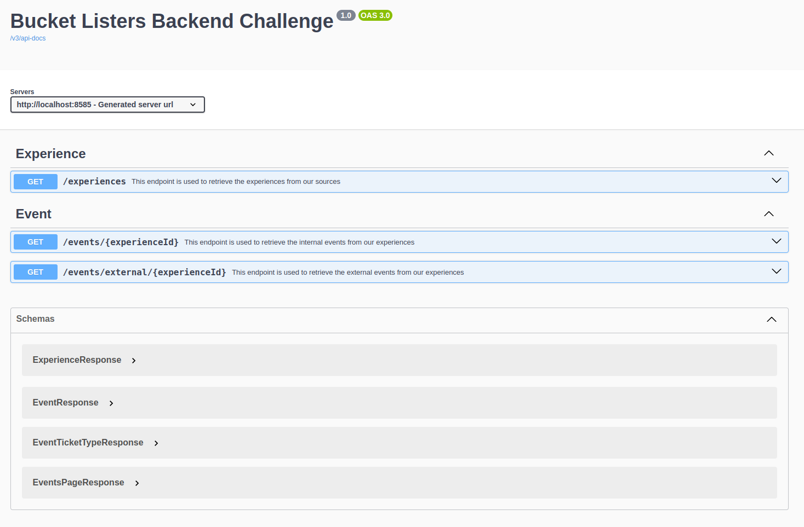

# bucketlisters-backend-challenge

This challenge is a simplified replica of a ticket management platform, designed to consume and list tickets from both our internal database and external APIs. <br> 
With this approach, we aim to simulate a realistic data integration scenario, allowing for efficient and scalable manipulation and display of ticket information.

## API Domain

### Experience
An experience is a set of events belonging to the same partner, consisting of representing a festival, a restaurant season, parks, and more.

### Event
An Event takes place at a specific single. Other systems may refer to this as “time slot”. An Event is always associated with an Experience.

### Event Ticket Type
A type of ticket that a user may purchase to a specific Event.  It has a name and price and some other data attached to it.  Note that an Event Ticket Type is associated with only one Event, meaning that each Event must define its own Event Ticket Types, even if the same template applies to many Events

## Environment Setup
1. Install Java 17 or Higher.<br>
I recommend SDKMAN! which makes this as simple as:
   ```
   sdk install java 17.0.7-zulu
   ```
2. gradle-8.10.2 or Higher
3. Use your favorite code editor to open and work on the code
4. Executing the code with:
   ```
   ./gradlew bootRun
   ```   
5. [Local Swagger](http://localhost:8585/swagger-ui/index.html#)

